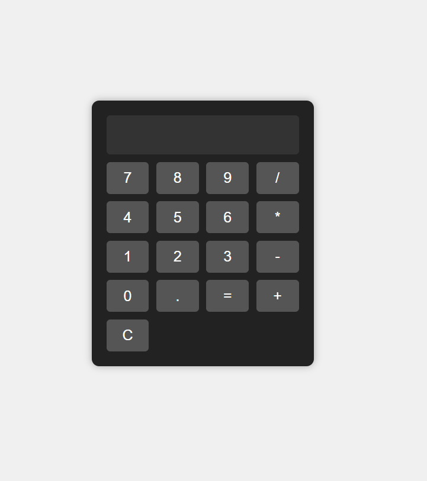

# Basic Calculator

## Description

This repository contains a basic looking calculator built using HTML, CSS, and JavaScript. The calculator has a modern design and basic arithmetic functionality. This was developed as an assignment task for CodSoft Internship

## How to Use

1. **Clone the repository:**
   
```git clone https://github.com/mehdiiwani/CodSoft-Level-1-Calculator.git```


3. **Navigate to the project folder:**
   
```cd CodSoft-Level-1-Calculator```


5. **Open `index.html` in your web browser:** Double-click on the `index.html` file, and the calculator will open in your default web browser.

## Features

- Modern and stylish user interface
- Basic arithmetic operations (+, -, *, /)
- Supports floating-point numbers
- Clear button (C) to reset the input
- Equal button (=) to evaluate the expression

## Preview



## Customization

You can customize the calculator's appearance by modifying the `styles.css` file. Feel free to experiment with different colors, fonts, and layout styles.

## Notes

- This calculator is for learning purposes and does not include advanced functionality or error handling. It may not be suitable for production use.
- Please ensure that JavaScript is enabled in your web browser to use the calculator.

---

Feel free to explore and use the CodSoft-Level-1-Calculator in your projects. If you have any suggestions or improvements, feel free to create a pull request or open an issue. Happy calculating! 🧮
